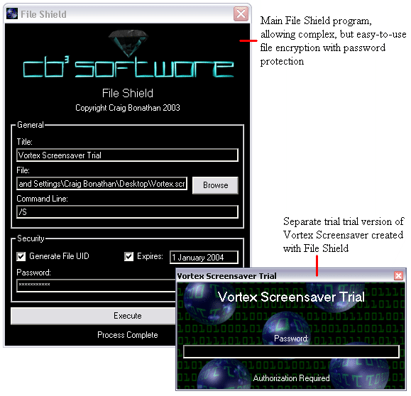



## File Shield: Password protect and encrypt ANY file easily

### Description

File Shield is a file protector application. It will encrypt any file and encose it inside another application (lock.exe), where it can then be decrypted and extracted with a correct password. If necessary, the file can be included with its own unique key, which will identify whether the protected file has been altered. Another useful feature is the expiration date system. You may choose to set a date when the program will no longer extract the file.

Encryption depends on the password. The password is not included in the executable at all. When a password is entered, a unique key is created for it. You cannot reverse a unique key encryption as it is one-way. This means that if you enter the wrong password, its unique key will not match the one that is in the file, so it will not extract. Since the file is encrypted with the password, only the same password will decrypt it. When the file UID generation is turned off, and on the VERY unlikely event that two passwords (one wrong, and one right) create the same unique key, the file will extract, but the data will be incorrect if the wrong password is used. When the UID generation is turned on, even a password with the same unique key will not extract the file because it would end up with an 'Extraction Error.' The file UID generation does not allow modified files to be extracted, which is definitely an advantage.

Any file can be protected with File Shield. When the protected executable is ran and the correct password is entered, it will extract the file, run it (with its associated application if it is a document), and then delete it as soon as the program that opened the file closes.
 
### More Info
 

             |
---                |---
**Submitted On**   |2003-07-08 19:18:10
**By**             |[Craig Bonathan](https://github.com/Planet-Source-Code/PSCIndex/blob/master/ByAuthor/craig-bonathan.md)
**Level**          |Advanced
**User Rating**    |5.0 (35 globes from 7 users)
**Compatibility**  |VB 6\.0
**Category**       |[Complete Applications](https://github.com/Planet-Source-Code/PSCIndex/blob/master/ByCategory/complete-applications__1-27.md)
**World**          |[Visual Basic](https://github.com/Planet-Source-Code/PSCIndex/blob/master/ByWorld/visual-basic.md)
**Archive File**   |[File\_Shiel161165782003\.zip](https://github.com/Planet-Source-Code/craig-bonathan-file-shield-password-protect-and-encrypt-any-file-easily__1-46737/archive/master.zip)

